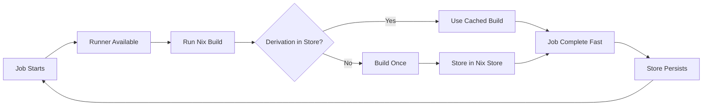

# Terraform Module: GitLab Runner with Native Nix Support on AWS

[](https://www.terraform.io/downloads.html)
[](https://registry.terraform.io/providers/hashicorp/aws/latest)
[](https://opensource.org/licenses/MIT)

A Terraform module for deploying auto-scaling GitLab runners on AWS with **native Nix flake support** - no Docker required!

## 🚀 Why This Module?

### The Problem with Docker-based Runners

Most GitLab runners use Docker images to run Nix flakes. This approach has significant drawbacks:


**Problems:**
- ❌ Every job starts from scratch
- ❌ No caching between jobs
- ❌ Wasted time rebuilding derivations
- ❌ Wasted money on redundant builds
- ❌ Complicated caching strategies that don't work well

### The Solution: Native Nix with Persistent Store

This module runs Nix natively on NixOS instances with a persistent Nix store:



**Benefits:**
- ✅ Derivations cached in the Nix store
- ✅ Subsequent builds are **10-100x faster**
- ✅ Massive cost savings (90%+ with spot instances)
- ✅ No Docker overhead
- ✅ Simple, elegant solution

## 📊 Cost Comparison

| Setup | Monthly Cost (10 runners) | Build Speed |
|-------|---------------------------|-------------|
| GitLab.com SaaS | $290-$580 | Baseline |
| Docker + NAT Gateway | ~$35-$40 | 1x (no cache) |
| **This Module (Nix + NAT Instance)** | **~$8-$15** | **10-100x** (with cache) |

## 🎯 Features

- **Native Nix Support**: Run Nix flakes without Docker
- **Persistent Nix Store**: Build once, use many times
- **Auto-scaling**: Intelligent scaling based on GitLab job queue
- **Cost-Optimized**: 90%+ cost savings with spot instances
- **High Availability**: Multi-AZ deployment
- **Flexible Networking**: BYO VPC or create new
- **Monitoring**: CloudWatch metrics and dashboards
- **Security**: SSM access, encrypted volumes, IMDSv2

## 📋 Requirements

- Terraform >= 1.3
- AWS Provider >= 5.0
- GitLab account with runner token
- AWS account with appropriate permissions

## 🚀 Quick Start

### 1. Create a GitLab Runner

In your GitLab project/group, create a new runner and get the authentication token:

1. Go to **Settings → CI/CD → Runners**
2. Click **New project runner** (or **New group runner**)
3. Configure runner settings:
   - Tags: `nixos`, `nix`, `shell`
   - Run untagged jobs: Your choice
4. Click **Create runner**
5. **Copy the token** (starts with `glrt-`)

### 2. Use the Module

```hcl
module "gitlab_runner" {
  source = "github.com/your-org/terraform-aws-gitlab-runner-nixos"

  # Required: Environment and GitLab configuration
  environment          = "production"
  gitlab_url           = "https://gitlab.com"  # or your GitLab instance
  gitlab_runner_token  = "glrt-xxxxxxxxxxxxx"  # Token from step 1

  # Optional: GitLab API for intelligent autoscaling
  enable_gitlab_metrics = true
  gitlab_token         = "glpat-xxxxxxxxxxxxx"  # Personal access token with read_api scope
  gitlab_project_id    = 12345

  # Capacity configuration
  max_instances               = 10
  min_idle_instances          = 1
  concurrent_jobs_per_instance = 2

  # Cost optimization
  on_demand_percentage = 10  # 90% spot instances

  # Tags for runners
  gitlab_runner_tags = ["nixos", "nix", "arm64", "shell"]

  tags = {
    Team        = "platform"
    CostCenter  = "engineering"
  }
}

output "runner_info" {
  value = {
    autoscaling_group = module.gitlab_runner.autoscaling_group_name
    vpc_id            = module.gitlab_runner.vpc_id
    nat_instance_ip   = module.gitlab_runner.nat_instance_public_ip
  }
}
```

### 3. Deploy

```bash
terraform init
terraform plan
terraform apply
```

### 4. Test Your Runner

Create a `.gitlab-ci.yml` in your repository:

```yaml
test:
  tags:
    - nixos
  script:
    - nix --version
    - nix flake show
    - nix build
```

## 📚 Usage Examples

### Basic Setup (Minimal Configuration)

```hcl
module "gitlab_runner" {
  source = "github.com/your-org/terraform-aws-gitlab-runner-nixos"

  environment         = "dev"
  gitlab_url          = "https://gitlab.com"
  gitlab_runner_token = var.gitlab_runner_token

  # Simple autoscaling
  max_instances      = 5
  min_idle_instances = 0  # Most cost-effective
}
```

### Production Setup (Full Features)

```hcl
module "gitlab_runner" {
  source = "github.com/your-org/terraform-aws-gitlab-runner-nixos"

  environment         = "production"
  gitlab_url          = "https://gitlab.example.com"
  gitlab_runner_token = var.gitlab_runner_token

  # Intelligent autoscaling with GitLab API
  enable_gitlab_metrics = true
  gitlab_token         = var.gitlab_api_token
  gitlab_project_id    = 12345

  # High capacity
  max_instances               = 50
  min_idle_instances          = 5
  concurrent_jobs_per_instance = 4

  # Larger instances for heavy builds
  instance_types = ["c6g.xlarge", "c7g.xlarge", "m6g.xlarge"]
  root_volume_size = 100  # GB, for large Nix store

  # Higher availability (more on-demand instances)
  on_demand_percentage = 30  # 70% spot

  # Use NAT Gateway instead of NAT Instance for better reliability
  enable_nat_gateway = true

  # Enhanced monitoring
  enable_cloudwatch_monitoring = true
  enable_ssm_access           = true

  tags = {
    Environment = "production"
    Team        = "platform"
    ManagedBy   = "terraform"
  }
}
```

### Using Existing VPC

```hcl
module "gitlab_runner" {
  source = "github.com/your-org/terraform-aws-gitlab-runner-nixos"

  environment         = "staging"
  gitlab_url          = "https://gitlab.com"
  gitlab_runner_token = var.gitlab_runner_token

  # Use existing VPC
  create_vpc = false
  vpc_id     = "vpc-xxxxx"
  subnet_ids = [
    "subnet-xxxxx",
    "subnet-yyyyy"
  ]

  max_instances = 10
}
```

### Multi-Region Setup

```hcl
# US East runners
module "gitlab_runner_us_east" {
  source = "github.com/your-org/terraform-aws-gitlab-runner-nixos"

  environment         = "us-east"
  aws_region          = "us-east-1"
  gitlab_url          = "https://gitlab.com"
  gitlab_runner_token = var.gitlab_runner_token

  gitlab_runner_tags = ["nixos", "us-east", "arm64"]
  max_instances      = 10
}

# EU West runners
module "gitlab_runner_eu_west" {
  source = "github.com/your-org/terraform-aws-gitlab-runner-nixos"

  environment         = "eu-west"
  aws_region          = "eu-west-1"
  gitlab_url          = "https://gitlab.com"
  gitlab_runner_token = var.gitlab_runner_token

  gitlab_runner_tags = ["nixos", "eu-west", "arm64"]
  max_instances      = 10
}
```

## 🏗️ Architecture

### Infrastructure Diagram

```
┌─────────────────────────────────────────────────────────────────┐
│                           AWS Cloud                              │
│                                                                   │
│  ┌────────────────────────────────────────────────────────────┐ │
│  │                      VPC (10.0.0.0/16)                     │ │
│  │                                                             │ │
│  │  ┌──────────────┐           ┌──────────────┐              │ │
│  │  │ Public Subnet│           │ Public Subnet│              │ │
│  │  │              │           │              │              │ │
│  │  │  ┌────────┐  │           │              │              │ │
│  │  │  │  NAT   │  │←──────────┤  Internet    │              │ │
│  │  │  │Instance│  │           │  Gateway     │              │ │
│  │  │  └────────┘  │           │              │              │ │
│  │  └──────┬───────┘           └──────────────┘              │ │
│  │         │                                                  │ │
│  │         │ (routes outbound)                                │ │
│  │         │                                                  │ │
│  │  ┌──────▼───────────────────────────────────────────────┐ │ │
│  │  │            Private Subnets (Multi-AZ)               │ │ │
│  │  │                                                      │ │ │
│  │  │  ┌─────────┐  ┌─────────┐  ┌─────────┐            │ │ │
│  │  │  │ NixOS   │  │ NixOS   │  │ NixOS   │  ...       │ │ │
│  │  │  │ Runner  │  │ Runner  │  │ Runner  │            │ │ │
│  │  │  │         │  │         │  │         │            │ │ │
│  │  │  │ ┌─────┐ │  │ ┌─────┐ │  │ ┌─────┐ │            │ │ │
│  │  │  │ │ Nix │ │  │ │ Nix │ │  │ │ Nix │ │            │ │ │
│  │  │  │ │Store│ │  │ │Store│ │  │ │Store│ │            │ │ │
│  │  │  │ └─────┘ │  │ └─────┘ │  │ └─────┘ │            │ │ │
│  │  │  └─────────┘  └─────────┘  └─────────┘            │ │ │
│  │  │                                                      │ │ │
│  │  │            Auto Scaling Group (0-50 instances)      │ │ │
│  │  └──────────────────────────────────────────────────────┘ │ │
│  └─────────────────────────────────────────────────────────────┘ │
│                                                                   │
│  ┌──────────────────────────────────────────────────────────┐   │
│  │              Lambda Function (Auto-Scaling)              │   │
│  │  • Checks GitLab API for pending jobs every 1 min       │   │
│  │  • Scales ASG up/down based on demand                   │   │
│  │  • Publishes metrics to CloudWatch                       │   │
│  └──────────────────────────────────────────────────────────┘   │
│                                                                   │
└───────────────────────────────────────────────────────────────────┘
```

### How It Works

1. **Runner Registration**: Runners register with GitLab using the provided token
2. **Job Polling**: Runners poll GitLab for new jobs
3. **Job Execution**: Jobs run natively on NixOS with the shell executor
4. **Nix Store**: Derivations are cached in the persistent Nix store
5. **Auto-Scaling**: Lambda function monitors GitLab queue and scales ASG
6. **Cost Optimization**: 90% spot instances for massive savings

### Autoscaling Logic

The module implements intelligent autoscaling inspired by GitLab's fleeting plugin:

```
Desired Capacity = ceil(
  pending_jobs / jobs_per_instance * scale_factor
) + min_idle_instances

Capped at:
  - Maximum: max_instances
  - Growth Rate: max_growth_rate per iteration
```

Scale-in occurs when utilization falls below `scale_in_threshold`.

## 📖 Module Documentation

### Inputs

| Name | Description | Type | Default | Required |
|------|-------------|------|---------|:--------:|
| `environment` | Environment name (e.g., production, staging) | `string` | n/a | yes |
| `gitlab_url` | GitLab instance URL | `string` | `"https://gitlab.com"` | no |
| `gitlab_runner_token` | GitLab runner authentication token | `string` | n/a | yes |
| `gitlab_runner_tags` | Tags for the GitLab runner | `list(string)` | `["nixos", "nix", "arm64", "shell"]` | no |
| `max_instances` | Maximum number of runner instances | `number` | `10` | no |
| `min_idle_instances` | Minimum number of idle instances to keep warm | `number` | `0` | no |
| `concurrent_jobs_per_instance` | Concurrent jobs per runner instance | `number` | `2` | no |
| `instance_types` | List of EC2 instance types | `list(string)` | `["t4g.medium", ...]` | no |
| `on_demand_percentage` | Percentage of on-demand vs spot instances | `number` | `10` | no |
| `root_volume_size` | Root volume size in GB | `number` | `40` | no |
| `enable_gitlab_metrics` | Enable GitLab API metrics collection | `bool` | `true` | no |
| `gitlab_token` | GitLab PAT with read_api scope (for metrics) | `string` | `""` | no |
| `gitlab_project_id` | GitLab project ID (for metrics) | `number` | `0` | no |
| `create_vpc` | Create a new VPC | `bool` | `true` | no |
| `vpc_id` | Existing VPC ID (if create_vpc is false) | `string` | `""` | no |
| `subnet_ids` | Existing subnet IDs (if create_vpc is false) | `list(string)` | `[]` | no |
| `enable_nat_gateway` | Use NAT Gateway instead of NAT Instance | `bool` | `false` | no |
| `enable_ssm_access` | Enable AWS Systems Manager access | `bool` | `true` | no |

<details>
<summary><b>View all inputs (50+)</b></summary>

See the [variables.tf](variables.tf) file for complete documentation of all input variables.

</details>

### Outputs

| Name | Description |
|------|-------------|
| `autoscaling_group_name` | Name of the Auto Scaling Group |
| `autoscaling_group_arn` | ARN of the Auto Scaling Group |
| `runner_iam_role_arn` | ARN of the IAM role used by runners |
| `runner_security_group_id` | ID of the security group for runners |
| `vpc_id` | ID of the VPC |
| `subnet_ids` | IDs of the subnets |
| `nat_instance_public_ip` | Public IP of the NAT instance (if used) |
| `lambda_function_name` | Name of the autoscaling Lambda function |
| `ssm_connect_command` | AWS CLI command to connect via SSM |
| `scaling_status_command` | AWS CLI command to check scaling status |

<details>
<summary><b>View all outputs</b></summary>

See the [outputs.tf](outputs.tf) file for complete documentation of all outputs.

</details>

## 🛠️ Advanced Configuration

### Custom NixOS Configuration

You can provide custom NixOS configuration:

```hcl
module "gitlab_runner" {
  source = "github.com/your-org/terraform-aws-gitlab-runner-nixos"

  environment         = "production"
  gitlab_runner_token = var.token

  custom_nixos_config = file("${path.module}/custom-runner-config.nix")
}
```

### Autoscaling Parameters

Fine-tune the autoscaling behavior:

```hcl
module "gitlab_runner" {
  source = "github.com/your-org/terraform-aws-gitlab-runner-nixos"

  environment         = "production"
  gitlab_runner_token = var.token

  # Scaling algorithm parameters
  scale_factor       = 1.2   # Slightly over-provision
  max_growth_rate    = 5     # Add max 5 instances per minute
  scale_in_threshold = 0.3   # Scale in when < 30% utilized

  # Lambda check frequency
  lambda_check_interval = 1  # Check every minute
}
```

### Security Hardening

```hcl
module "gitlab_runner" {
  source = "github.com/your-org/terraform-aws-gitlab-runner-nixos"

  environment         = "production"
  gitlab_runner_token = var.token

  # Disable SSM access
  enable_ssm_access = false

  # No SSH access to NAT instance
  allowed_ssh_cidr_blocks = []

  # Additional security groups
  additional_security_group_ids = [
    aws_security_group.additional.id
  ]
}
```

## 🔍 Monitoring

### CloudWatch Metrics

The module publishes the following metrics to CloudWatch:

- **Namespace**: `GitLab/CI`
  - `PendingJobs`: Number of pending jobs in queue
  - `RunningJobs`: Number of currently running jobs
  - `AvailableRunners`: Number of available runners

- **Namespace**: `GitLab/Runner`
  - `RunnerHealthy`: Health status of individual runners

### CloudWatch Dashboard

Access the CloudWatch dashboard:

```bash
terraform output cloudwatch_dashboard_url
```

### Checking Runner Status

```bash
# Get ASG status
terraform output -raw scaling_status_command | bash

# Connect to runner via SSM
INSTANCE_ID=$(aws autoscaling describe-auto-scaling-groups \
  --auto-scaling-group-names $(terraform output -raw autoscaling_group_name) \
  --query 'AutoScalingGroups[0].Instances[0].InstanceId' \
  --output text)

aws ssm start-session --target $INSTANCE_ID

# Once connected, check runner status
sudo systemctl status gitlab-runner
sudo gitlab-runner verify
```

### Lambda Logs

```bash
terraform output -raw lambda_logs_command | bash
```

## 💰 Cost Optimization

### Cost Breakdown (Monthly, 10 runners example)

| Component | Cost (t4g.medium, us-east-1) |
|-----------|------------------------------|
| **Spot Instances** (90%): 9 x $0.0084/hr | ~$5.50 |
| **On-Demand Instances** (10%): 1 x $0.0336/hr | ~$24.50 |
| **NAT Instance** (t3.nano): $0.0052/hr | ~$3.80 |
| **Data Transfer**: varies | ~$2-5 |
| **Lambda**: 43,200 invocations/month | ~$0.01 |
| **CloudWatch**: Basic monitoring | ~$1-2 |
| **Total** | **~$12-15/month** |

Compare to:
- GitLab.com SaaS (10 runners): **$290-$580/month**
- Docker-based with NAT Gateway: **$35-$40/month**

### Cost Optimization Tips

1. **Use spot instances**: Set `on_demand_percentage = 0-10%` (default)
2. **NAT Instance over Gateway**: Save ~$30/month (default)
3. **Minimal idle instances**: Set `min_idle_instances = 0-1`
4. **Right-size instances**: Start with `t4g.small` or `t4g.medium`
5. **Enable intelligent scaling**: Use GitLab API metrics
6. **Multi-region**: Deploy only where needed

## 🐛 Troubleshooting

### Runners not registering

```bash
# Check runner logs
aws ssm start-session --target <instance-id>
sudo journalctl -u gitlab-runner -f

# Verify token
sudo cat /etc/gitlab-runner-authentication.env

# Test GitLab connectivity
curl -v https://gitlab.com
```

### Autoscaling not working

```bash
# Check Lambda logs
aws logs tail /aws/lambda/<function-name> --follow

# Verify IAM permissions
aws autoscaling describe-auto-scaling-groups \
  --auto-scaling-group-names <asg-name>

# Check GitLab API token
curl -H "PRIVATE-TOKEN: $GITLAB_TOKEN" \
  "https://gitlab.com/api/v4/projects/<project-id>/jobs?scope=pending"
```

### Slow builds

```bash
# Check Nix store size
du -sh /nix/store

# Verify cache is working
nix path-info --all | wc -l

# Check system resources
htop
df -h
```

### Connectivity issues

```bash
# From NAT instance, test routing
ping 8.8.8.8
traceroute gitlab.com

# Check iptables
sudo iptables -L -n -v
sudo iptables -t nat -L -n -v

# From runner, test Internet
curl -v https://gitlab.com
curl -v https://cache.nixos.org
```

## 🤝 Contributing

Contributions are welcome! Please:

1. Fork the repository
2. Create a feature branch
3. Make your changes
4. Test thoroughly
5. Submit a pull request

## 📄 License

MIT License - see [LICENSE](LICENSE) file for details.

## 🙏 Acknowledgments

- Inspired by [cattle-ops/terraform-aws-gitlab-runner](https://github.com/cattle-ops/terraform-aws-gitlab-runner)
- Built on the excellent NixOS project
- Autoscaling logic inspired by GitLab's fleeting plugin

## 📞 Support

- **Issues**: [GitHub Issues](https://github.com/your-org/terraform-aws-gitlab-runner-nixos/issues)
- **Discussions**: [GitHub Discussions](https://github.com/your-org/terraform-aws-gitlab-runner-nixos/discussions)

---

**Made with ❤️ for the Nix community**
