# Terraform Module: GitLab Runner with Native Nix Support on AWS

[](https://www.terraform.io/downloads.html)
[](https://registry.terraform.io/providers/hashicorp/aws/latest)
[](https://opensource.org/licenses/MIT)

A Terraform module for deploying auto-scaling GitLab runners on AWS with **native Nix flake support** - no Docker required!

## 🚀 Why This Module?

### The Problem: Docker-based Runners

Most GitLab runner modules use Docker with a **deceptive architecture**: they register a single runner with GitLab, then use custom orchestration code to distribute jobs across multiple containers. This creates several critical issues:

**Key Problems:**
- 🚨 **Hidden Complexity**: GitLab sees 1 runner, but there are actually N containers behind custom code
- 🚨 **Single Point of Failure**: If the custom orchestration fails, all jobs stop
- 🚨 **No Persistent Caching**: Every job starts from scratch in a fresh container
- 🚨 **Docker Overhead**: Image pulling, layer management, and containerization slow down builds
- 🚨 **Complex S3 Caching**: Requires complex cache management with lifecycle policies

### Our Solution: Direct Registration + Native NixOS

This module uses **transparent direct registration** where each NixOS instance is an independent GitLab runner with a persistent Nix store:


**Key Advantages:**

| Aspect | Docker-Machine Approach | Our Direct Registration |
|--------|------------------------|------------------------|
| **Architecture** | Single runner + custom orchestration | Multiple independent runners |
| **Visibility** | GitLab sees 1 runner, reality is N containers | GitLab sees actual N runners |
| **Failure Impact** | Custom code failure stops all jobs | Each runner is independent |
| **Caching** | Complex S3 cache with lifecycle policies | Persistent Nix store |
| **Build Speed** | Every job rebuilds from scratch | Incremental builds using cache |
| **Overhead** | Docker layer management | Direct native execution |
| **Maintenance** | Complex custom code to maintain | Minimal custom code |

## 🎯 Key Features

- **Native Nix Support**: Run Nix flakes directly on NixOS without Docker
- **Persistent Nix Store**: Build once, use many times - significant speedups
- **Intelligent Auto-scaling**: Lambda-based scaling monitors GitLab job queue
- **Direct Runner Registration**: Each instance is an independent runner (no orchestration overhead)
- **High Availability**: Multi-AZ deployment with spot instances
- **Flexible Networking**: BYO VPC or auto-create with NAT instance/gateway
- **Security**: SSM access, encrypted volumes, IMDSv2 enforced
- **Customizable**: Add custom NixOS configuration blocks

## 🏗️ Architecture

### Infrastructure Diagram

```mermaid
graph TB
    subgraph AWS["AWS Cloud"]
        subgraph VPC["VPC (10.0.0.0/16)"]
            subgraph PublicSubnets["Public Subnets (Multi-AZ)"]
                IGW["Internet Gateway"]
                NAT["NAT Instance"]
            end

            subgraph PrivateSubnets["Private Subnets (Multi-AZ)"]
                subgraph ASG["Auto Scaling Group"]
                    Runner1["NixOS Runner<br/>└─ Nix Store"]
                    Runner2["NixOS Runner<br/>└─ Nix Store"]
                    Runner3["NixOS Runner<br/>└─ Nix Store"]
                end
            end

            subgraph Lambda["Lambda Function"]
                LambdaFunc["Auto-Scaling Logic<br/>• Checks GitLab API<br/>• Scales ASG<br/>• Publishes metrics"]
            end

            subgraph CloudWatch["CloudWatch"]
                Metrics["Metrics & Dashboards"]
            end
        end

        subgraph External["External Services"]
            GitLab["GitLab CI/CD"]
        end
    end

    %% Connections
    IGW -->|"Internet"| NAT
    NAT -->|"Outbound"| Runner1
    NAT -->|"Outbound"| Runner2
    NAT -->|"Outbound"| Runner3

    LambdaFunc -->|"Scale"| ASG
    LambdaFunc -->|"Metrics"| Metrics
    LambdaFunc -->|"API"| GitLab

    Runner1 -->|"Jobs"| GitLab
    Runner2 -->|"Jobs"| GitLab
    Runner3 -->|"Jobs"| GitLab

    %% Styling
    classDef aws fill:#f3e8ff,stroke:#7c3aed,stroke-width:3px,color:#581c87
    classDef vpc fill:#e9d5ff,stroke:#8b5cf6,stroke-width:3px,color:#581c87
    classDef public fill:#ddd6fe,stroke:#a855f7,stroke-width:3px,color:#581c87
    classDef private fill:#c4b5fd,stroke:#c084fc,stroke-width:3px,color:#581c87
    classDef lambda fill:#a78bfa,stroke:#d946ef,stroke-width:3px,color:#581c87
    classDef external fill:#fbbf24,stroke:#f59e0b,stroke-width:3px,color:#92400e

    class AWS aws
    class VPC vpc
    class PublicSubnets public
    class PrivateSubnets private
    class Lambda lambda
    class External external

    %% Link styling - make connections more visible
    linkStyle 0 stroke:#7c3aed,stroke-width:3px
    linkStyle 1 stroke:#7c3aed,stroke-width:3px
    linkStyle 2 stroke:#7c3aed,stroke-width:3px
    linkStyle 3 stroke:#7c3aed,stroke-width:3px
    linkStyle 4 stroke:#d946ef,stroke-width:3px
    linkStyle 5 stroke:#d946ef,stroke-width:3px
    linkStyle 6 stroke:#d946ef,stroke-width:3px
    linkStyle 7 stroke:#f59e0b,stroke-width:3px
    linkStyle 8 stroke:#f59e0b,stroke-width:3px
    linkStyle 9 stroke:#f59e0b,stroke-width:3px
```



### How It Works

1. **Runner Registration**: Runners register with GitLab using the provided token
2. **Job Polling**: Runners poll GitLab for new jobs
3. **Job Execution**: Jobs run natively on NixOS with the shell executor
4. **Nix Store**: Derivations are cached in the persistent Nix store
5. **Auto-Scaling**: Lambda function monitors GitLab queue and scales ASG

### Scaling Formula

```
Desired Capacity = ceil(pending_jobs / jobs_per_instance × scale_factor) + min_idle_instances

Capped at: max_instances and max_growth_rate per check
```

The Lambda function checks GitLab's API every 1-5 minutes (configurable) and adjusts capacity based on pending jobs.

## 📋 Requirements

- Terraform >= 1.3
- AWS Provider >= 5.0
- GitLab Provider >= 16.0
- GitLab account with API access
- AWS account with appropriate permissions

## 🚀 Quick Start

### Prerequisites

- Terraform >= 1.3 installed
- AWS CLI configured
- **GitLab Personal Access Token** with `create_runner` and `read_api` scopes ([create one here](https://gitlab.com/-/user_settings/personal_access_tokens))
- **GitLab Project ID** (find it on your project's main page)

### Basic Usage

Create a `main.tf` file:

```hcl
module "gitlab_runner" {
  source = "github.com/your-org/terraform-aws-gitlab-runner-nixos"

  # Required: Environment and GitLab configuration
  environment          = "production"
  gitlab_url           = "https://gitlab.com"  # or your GitLab instance
  gitlab_token         = var.gitlab_token     # Personal access token
  gitlab_project_id    = 12345  # Your GitLab project ID

  # Optional: GitLab API for intelligent autoscaling
  enable_gitlab_metrics = true

  # Capacity configuration
  max_instances               = 10
  min_idle_instances          = 1
  concurrent_jobs_per_instance = 2

  # Tags for runners
  gitlab_runner_tags = ["nixos", "nix", "arm64", "shell"]

  # Additional tags
  tags = {
    Team        = "platform"
    CostCenter  = "engineering"
  }
}

output "runner_info" {
  value = {
    autoscaling_group = module.gitlab_runner.autoscaling_group_name
    vpc_id            = module.gitlab_runner.vpc_id
    nat_instance_ip   = module.gitlab_runner.nat_instance_public_ip
  }
}
```

### Deploy

```bash
terraform init
terraform apply
```

### Verify

Create a `.gitlab-ci.yml` in your repository:

```yaml
test:
  tags:
    - nixos
  script:
    - nix --version
    - nix flake show
    - nix build
```

## 📚 Common Configurations

### Using Existing VPC

```hcl
module "gitlab_runner" {
  source = "github.com/your-org/terraform-aws-gitlab-runner-nixos"

  environment       = "production"
  gitlab_token      = var.gitlab_token
  gitlab_project_id = var.gitlab_project_id

  # Use existing VPC
  create_vpc = false
  vpc_id     = "vpc-xxxxx"
  subnet_ids = ["subnet-xxxxx", "subnet-yyyyy"]
}
```


## 📖 Module Documentation

### Inputs

| Name | Description | Type | Default | Required |
|------|-------------|------|---------|:--------:|
| `environment` | Environment name (e.g., production, staging) | `string` | n/a | yes |
| `gitlab_url` | GitLab instance URL | `string` | `"https://gitlab.com"` | no |
| `gitlab_token` | GitLab Personal Access Token with 'create_runner' scope | `string` | n/a | yes |
| `gitlab_project_id` | GitLab Project ID where the runner will be registered | `number` | n/a | yes |
| `gitlab_runner_tags` | Tags for the GitLab runner | `list(string)` | `["nixos", "nix", "arm64", "shell"]` | no |
| `max_instances` | Maximum number of runner instances | `number` | `10` | no |
| `min_idle_instances` | Minimum number of idle instances to keep warm | `number` | `0` | no |
| `concurrent_jobs_per_instance` | Concurrent jobs per runner instance | `number` | `2` | no |
| `instance_types` | List of EC2 instance types | `list(string)` | `["t4g.medium", ...]` | no |
| `spot_allocation_strategy` | Spot instance allocation strategy | `string` | `"price-capacity-optimized"` | no |
| `root_volume_size` | Root volume size in GB | `number` | `40` | no |
| `gitlab_runner_volume_size` | Additional EBS volume size for GitLab Runner builds in GB | `number` | `100` | no |
| `gitlab_runner_volume_type` | Type of the GitLab Runner volume (gp2, gp3, io1, io2) | `string` | `gp3` | no |
| `enable_gitlab_metrics` | Enable GitLab API metrics collection | `bool` | `true` | no |
| `create_vpc` | Create a new VPC | `bool` | `true` | no |
| `vpc_id` | Existing VPC ID (if create_vpc is false) | `string` | `""` | no |
| `subnet_ids` | Existing subnet IDs (if create_vpc is false) | `list(string)` | `[]` | no |
| `enable_nat_gateway` | Use NAT Gateway instead of NAT Instance | `bool` | `false` | no |
| `enable_ssm_access` | Enable AWS Systems Manager access | `bool` | `true` | no |
| `additional_nixos_configs` | List of additional NixOS configuration blocks to import | `list(string)` | `[]` | no |

<details>
<summary><b>View all inputs (50+)</b></summary>

See the [variables.tf](variables.tf) file for complete documentation of all input variables.

</details>

### Outputs

| Name | Description |
|------|-------------|
| `autoscaling_group_name` | Name of the Auto Scaling Group |
| `autoscaling_group_arn` | ARN of the Auto Scaling Group |
| `runner_iam_role_arn` | ARN of the IAM role used by runners |
| `runner_security_group_id` | ID of the security group for runners |
| `vpc_id` | ID of the VPC |
| `subnet_ids` | IDs of the subnets |
| `nat_instance_public_ip` | Public IP of the NAT instance (if used) |
| `lambda_function_name` | Name of the autoscaling Lambda function |
| `ssm_connect_command` | AWS CLI command to connect via SSM |
| `scaling_status_command` | AWS CLI command to check scaling status |

<details>
<summary><b>View all outputs</b></summary>

See the [outputs.tf](outputs.tf) file for complete documentation of all outputs.

</details>

### Custom NixOS Configuration

```hcl
module "gitlab_runner" {
  source = "github.com/your-org/terraform-aws-gitlab-runner-nixos"

  environment       = "production"
  gitlab_token      = var.gitlab_token
  gitlab_project_id = var.gitlab_project_id

  # Add custom packages or configuration
  additional_nixos_configs = [
    "{ config, pkgs, ... }: { environment.systemPackages = with pkgs; [ vim git ]; }"
  ]
}
```

### Scaling Configuration

```hcl
module "gitlab_runner" {
  source = "github.com/your-org/terraform-aws-gitlab-runner-nixos"

  environment       = "production"
  gitlab_token      = var.gitlab_token
  gitlab_project_id = var.gitlab_project_id

  max_instances      = 20
  min_idle_instances = 2
  scale_factor       = 1.2
}
```

## 🔍 Monitoring

Check scaling status:

```bash
terraform output -raw scaling_status_command | bash
```

Connect to a runner instance:

```bash
# Get instance ID
INSTANCE_ID=$(aws autoscaling describe-auto-scaling-groups \
  --auto-scaling-group-names $(terraform output -raw autoscaling_group_name) \
  --query 'AutoScalingGroups[0].Instances[0].InstanceId' \
  --output text)

# Connect via SSM
aws ssm start-session --target $INSTANCE_ID
```

## 🐛 Troubleshooting

**Runners not registering:**
```bash
# Check runner logs on instance
aws ssm start-session --target <instance-id>
sudo journalctl -u gitlab-runner -f
```

**Autoscaling not working:**
```bash
# Check Lambda logs
terraform output -raw lambda_logs_command | bash
```

**Slow builds:**
```bash
# Verify Nix cache is working
nix path-info --all | wc -l
```

## 📄 License

MIT License - see [LICENSE](LICENSE) file for details.
